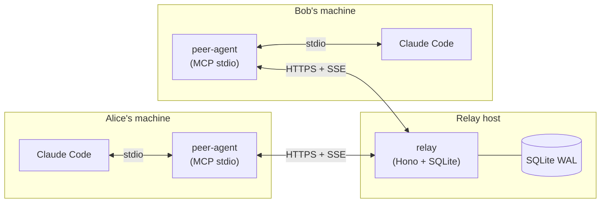
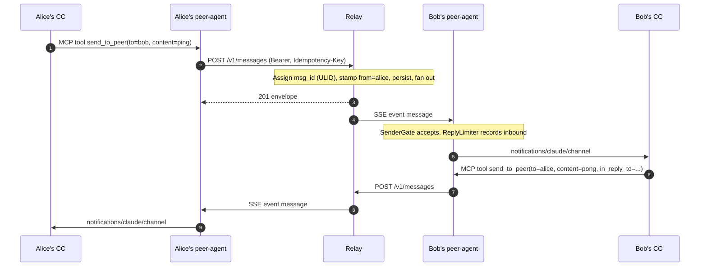
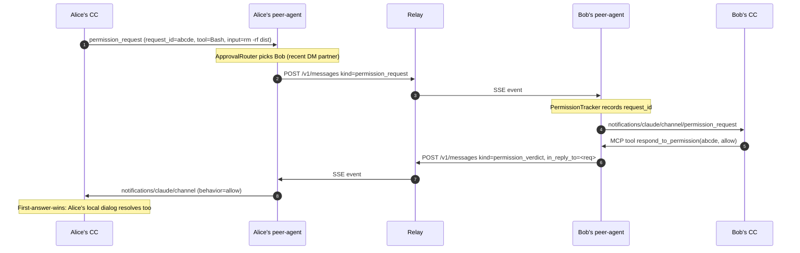
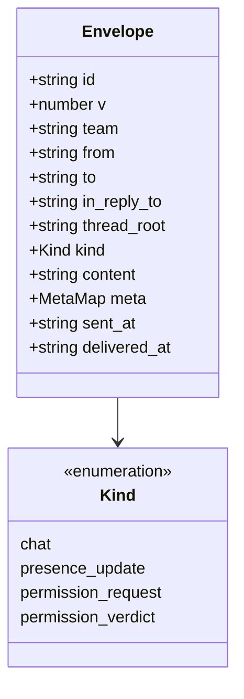
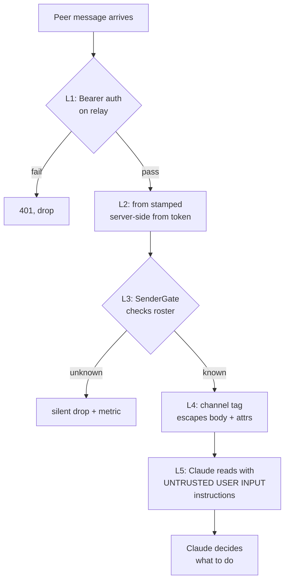

# claude-mesh

**Networked Claude-to-Claude messaging over HTTP + MCP channels.**

`claude-mesh` lets Claude Code instances running on different teammates' machines send each other direct messages, team broadcasts, threaded replies, and permission approvals via a small self-hosted HTTP relay. Inbound peer messages land in Claude's context as `<channel source="peers" ...>` tags; outbound goes through MCP tools.

> **Status:** software-complete per the [implementation plan](docs/superpowers/plans/2026-04-17-claude-mesh-implementation.md) (33 tasks, 147 tests passing). **Not yet run end-to-end against real Claude Code.** See [Caveats](#caveats).

## Table of contents

- [Architecture](#architecture)
- [Message flow](#message-flow)
- [Permission relay flow](#permission-relay-flow)
- [Wire format](#wire-format)
- [Requirements](#requirements)
- [Quickstart (admin)](#quickstart-admin)
- [Quickstart (teammate)](#quickstart-teammate)
- [CLI reference](#cli-reference)
- [Packages](#packages)
- [Development](#development)
- [Security model](#security-model)
- [Caveats](#caveats)
- [License](#license)

## Architecture

Three deployable units. Peer-agent speaks MCP over stdio to Claude Code locally, and HTTPS/SSE to the relay remotely.



**Key invariant:** the relay sets `from` on every message from the authenticated token. Peer-agents cannot spoof identity.

## Message flow

Direct message from Alice's Claude to Bob's Claude. Single `chat` envelope, end to end.



## Permission relay flow

Alice asks Bob to approve a destructive command. **Default-off**; requires `permission_relay.enabled=true` in both peer-agents' configs.



Alternative path: Bob runs `mesh respond abcde allow` from his CLI; the relay synthesizes the verdict envelope via `POST /v1/permission/respond`.

## Wire format

One envelope for all kinds. Zod's `superRefine` enforces `permission_verdict` carries an `in_reply_to`.



`id` is `msg_<ULID>` (monotonic within a millisecond). The SSE resume cursor `?since=<id>` relies on strict ULID ordering.

The peer-agent serializes inbound envelopes into MCP notifications:

- `chat` → `notifications/claude/channel`
- `permission_request` → `notifications/claude/channel/permission_request`
- `permission_verdict` → `notifications/claude/channel/permission`

See `packages/shared/src/channel.ts`.

## Requirements

- **Claude Code v2.1.80+** (v2.1.81+ for permission relay), signed in with `claude.ai`. Research-preview `claude/channel` capability is not available on API-key / Console auth.
- Team / Enterprise orgs: admin must enable channels via the `channelsEnabled` policy.
- **Node 22+** with pnpm 10 for local dev. Native `better-sqlite3` binding is built via `node-gyp` if no prebuilt exists for your Node version (MSVC on Windows, `build-essential` on Linux).
- For Docker: a Linux host with Docker + DNS if you're using the bundled Caddy TLS.

## Quickstart (admin)

### 1. Clone and build

```bash
git clone <your fork> claude-mesh && cd claude-mesh
pnpm install
pnpm -r build
```

### 2. Stand up a relay

**Docker + Caddy** (production, auto-TLS):

```bash
cd docker
cp Caddyfile.example Caddyfile        # edit: set your domain
docker compose up -d relay
docker compose run --rm relay init    # prompts for team name, admin handle
docker compose up -d caddy
```

The `init` step writes `/data/admin.token` and `/data/<admin-handle>.paircode` inside the relay volume. Read them with `docker compose exec relay cat /data/admin.token`.

**Bare Node** (dev):

```bash
MESH_DATA=./.mesh-data PORT=8443 node packages/relay/dist/index.js init
# in another terminal:
MESH_DATA=./.mesh-data PORT=8443 node packages/relay/dist/index.js
```

See [docs/DEPLOY.md](docs/DEPLOY.md) for the full three recipes (VPS, Tailscale-internal, Fly.io / Railway).

### 3. Bootstrap your admin CLI

```bash
mesh admin bootstrap \
  --token-file ./.mesh-data/admin.token \
  --relay https://mesh.example.com
```

This copies the admin token into `~/.claude-mesh/admin-token` (mode 0600). Later `mesh admin ...` calls read it from there.

### 4. Add teammates

```bash
mesh admin add-user --handle bob --display-name "Bob" --relay https://mesh.example.com
# prints: MESH-XXXX-XXXX-XXXX (single-use, 24h TTL)
```

Share the pair code with Bob out of band (Signal, 1Password, whatever).

## Quickstart (teammate)

### 1. Install the peer-agent

Once published:

```bash
bun add -g @claude-mesh/peer-agent
# or: npm i -g @claude-mesh/peer-agent
```

From this checkout today:

```bash
pnpm -F @claude-mesh/peer-agent build
npm link packages/peer-agent   # exposes `mesh` and `claude-mesh-peer-agent`
```

### 2. Pair against the relay

```bash
mesh pair \
  --relay https://mesh.example.com \
  MESH-XXXX-XXXX-XXXX \
  --label "bob-laptop"
```

This:

- POSTs the pair code to `/v1/auth/pair`, receives a 43-char bearer token
- writes `~/.claude-mesh/token` (mode 0600) and `~/.claude-mesh/config.json`
- registers the peer-agent in `~/.claude.json` under `mcpServers["claude-mesh-peers"]`

### 3. Restart Claude Code

The next session exposes three new MCP tools: `send_to_peer`, `list_peers`, `set_summary`. Inbound peer messages arrive as `<channel source="peers" ...>` tags in context.

Example session:

```
You: "Ping alice and ask what branch she's on."
Claude: (calls send_to_peer with to=alice, content="what branch?")
...a few seconds later, in context...
<channel source="peers" from="alice" msg_id="msg_01HR...">feat/auth-refactor</channel>
Claude: "Alice says she's on feat/auth-refactor."
```

## CLI reference

```
mesh pair --relay <url> <MESH-XXXX-XXXX-XXXX> [--label <device>]
mesh send <to> <content> [--relay <url>]
mesh respond <request_id> allow|deny [--reason "..."] [--relay <url>]

mesh admin bootstrap   --token-file <path>             [--relay <url>]
mesh admin add-user    --handle <h> [--display-name <n>] [--tier human|admin] [--relay <url>]
mesh admin disable-user <handle>                       [--relay <url>]
mesh admin revoke-token <token_id>                     [--relay <url>]
mesh admin audit       [--since <ISO8601>]             [--relay <url>]
```

Relay URL can also be set via `MESH_RELAY` env var.

## Packages

```
.
├── docker/                # Dockerfile + compose + Caddy config
├── docs/
│   ├── DEPLOY.md
│   ├── SECURITY.md
│   └── superpowers/       # spec + implementation plan
└── packages/
    ├── shared/            # envelope schema, channel serializer, ULID helpers
    ├── relay/             # Hono HTTP relay, SQLite store, SSE fan-out
    ├── peer-agent/        # MCP server + SSE client + `mesh` CLI
    └── e2e/               # L3 harness: in-memory relay + paired humans
```

Coverage thresholds (enforced in each package's `vitest.config.ts`): 95% lines on `shared`, 85% on `relay` and `peer-agent`.

## Development

```bash
pnpm install
pnpm -r build
pnpm -r typecheck
pnpm -r exec vitest run

# Scope to one package:
pnpm -F @claude-mesh/relay exec vitest run
pnpm -F @claude-mesh/shared exec vitest run -t "round-trip"

# L3 end-to-end (requires `claude` CLI or CLAUDE_DRIVER=agent-sdk):
CLAUDE_DRIVER=cli pnpm -F @claude-mesh/e2e exec vitest run
```

### Adding a new envelope `kind`

The envelope schema is the single wire-format source of truth. To add a kind:

1. Extend `KindSchema` in `packages/shared/src/envelope.ts`.
2. Add a mapping branch in `packages/shared/src/channel.ts` (which MCP notification method it maps to).
3. Update the `CHECK` constraint in `packages/relay/src/db/schema.sql` behind a bumped `schema_version` + migration.
4. Write the TDD test in each of the three packages before wiring.

See [CLAUDE.md](CLAUDE.md) for invariants that must hold.

## Security model

Five layers, defense in depth. Summary flow:



**Defaults you should know:**

- `permission_relay.enabled = false` out of the box.
- `approval_routing = never_relay` by default.
- Token files are chmod 0600; the peer-agent refuses to start if the token lives in a git worktree with a remote (defense against accidental token leaks via `git push`).
- Reply-storm limiter: `send_to_peer` capped at 2 replies per inbound peer message within 10 seconds.
- Tokens are never logged, never passed as env vars to child processes, never exposed to the LLM.

See [docs/SECURITY.md](docs/SECURITY.md) for the threat model, layered defenses, and disclosure policy.

## Caveats

Honest state of the repo as of the last commit:

- **Never run against real Claude Code.** The L3 scenario tests that would exercise `send_to_peer` end to end (`dm.test.ts`, `broadcast.test.ts`) are gated behind `CLAUDE_DRIVER=cli` and skip by default. Before relying on this in a trusted team, smoke-test with two real Claude sessions first.
- **Docker image not yet built.** `docker/Dockerfile.relay` is written but `docker build` has never actually run. Expect a first-run iteration.
- **Outbound permission_request flow incomplete.** The `ApprovalRouter` class and DM-recency tracking are implemented and unit-tested; the MCP `setNotificationHandler` that would turn a Claude Code → peer-agent `permission_request` notification into an outbound envelope (plan Task 24 Step 3) is not wired. `respond_to_permission` (the verdict path) works; initiating a request from CC needs one more bit of wiring.
- **Research-preview dependency.** `claude/channel` is research-preview; wire format may change across Claude Code releases. The L3 scenario tests are the early-warning system.
- **Single-region only.** No multi-region HA, no replication.
- **Admin token is a single-secret failure mode.** Rotate; consider mTLS for admin calls in a future revision.

## License

MIT
