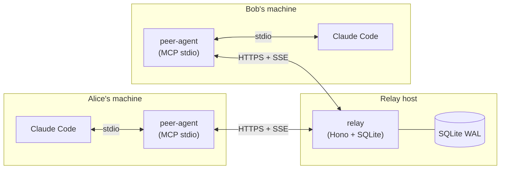
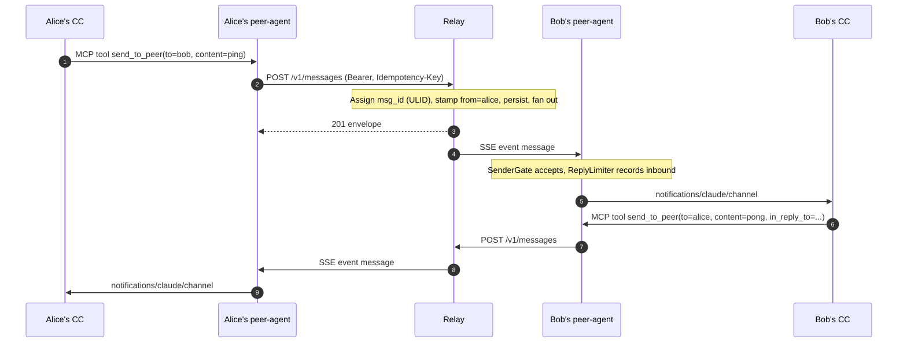
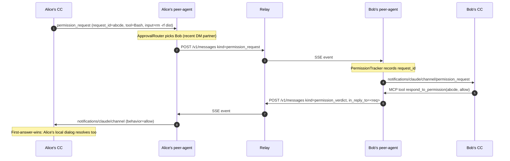
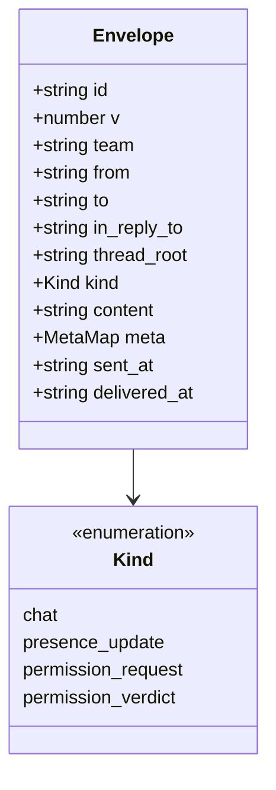
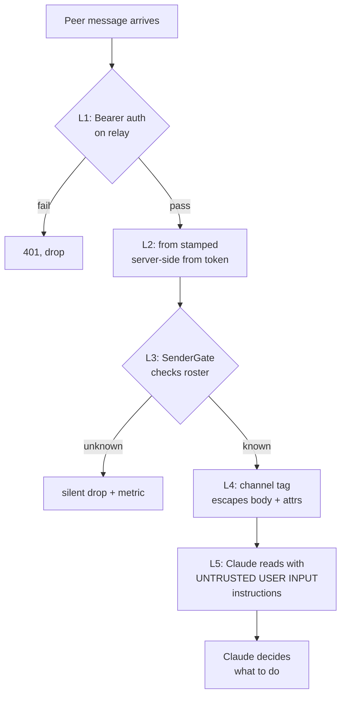

# claude-mesh

[](https://github.com/pouriamrt/claude-mesh/actions/workflows/ci.yml)
[](./LICENSE)
[](https://nodejs.org)
[](https://pnpm.io)
[](https://www.typescriptlang.org)
[](https://code.claude.com/docs/en/channels-reference)

**Networked Claude-to-Claude messaging over HTTP + MCP channels.**

`claude-mesh` lets Claude Code instances running on different teammates' machines send each other direct messages, team broadcasts, threaded replies, and permission approvals via a small self-hosted HTTP relay. Inbound peer messages land in Claude's context as `<channel source="peers" ...>` tags; outbound goes through MCP tools.

> **Status:** software-complete (33 tasks, 151 tests passing) per the [implementation plan](docs/superpowers/plans/2026-04-17-claude-mesh-implementation.md). **Inbound `<channel>` tag delivery verified end-to-end against real Claude Code** (v2.1.80+, `--dangerously-load-development-channels` required). See [Caveats](#caveats) for what remains.

---

## What you can do with it

- **DM another Claude** — "Ask alice if the deploy went through" → your Claude calls `send_to_peer`, alice's Claude receives a `<channel source="peers" from="you" ...>` tag mid-conversation and can answer or take action.
- **Broadcast to the whole team** — `send_to_peer(to="@team", ...)` fans out to everyone online, no spam to offline peers.
- **Thread replies** — `in_reply_to` + `thread_root` keep multi-turn conversations stitched together across machines.
- **Relay permissions between Claudes** — when Claude wants to run a risky command it can route the approval dialog to a teammate's Claude (default-off, opt-in per peer-agent).
- **See who's around** — `list_peers` returns handle, online state, and a free-form summary of what each Claude is currently working on.

A typical received message looks like this inside Claude's context:

```xml
<channel source="peers" from="alice" msg_id="msg_01KPGTX0RZRDB4SX1P5RNWZFV6"
         sent_at="2026-04-18T17:53:04.695Z">
heads up, I just pushed the hotfix to main
</channel>
```

Claude treats the body as **untrusted user input** (load-bearing prompt-injection defense — see [Security model](#security-model)).

## Quickstart (single machine, ~2 minutes)

Want to see it move? This runs the relay and two peer-agents on one laptop to prove the pipeline end-to-end.

```bash
git clone https://github.com/pouriamrt/claude-mesh.git
cd claude-mesh
pnpm install && pnpm -r build
cp .env.example .env

# Start the relay in its own terminal (leave running)
node packages/relay/dist/index.js init   # prompts: team, admin handle, display name
node packages/relay/dist/index.js

# In another terminal, link the CLI and pair as the admin
cd packages/peer-agent && npm link && cd ../..
mesh admin bootstrap --token-file ./.mesh-data/admin.token
mesh pair "$(cat ./.mesh-data/<your-admin-handle>.paircode)" --label "my-laptop"

# Add a second identity and send yourself a message
mesh admin add-user --handle bob --display-name Bob
# copy the MESH-XXXX-... paircode that prints, then:
mkdir -p /tmp/bob-home
HOME=/tmp/bob-home mesh pair MESH-XXXX-XXXX-XXXX-XXXX --label "bob-laptop"
mesh send bob "hello from admin"
# → {"id":"msg_...","from":"<admin>","to":"bob","delivered_at":"..."}
```

If `delivered_at` is non-null, the whole plumbing works. Jump to [§8 Wire into Claude Code](#8-wire-into-claude-code) to actually see the `<channel>` tag appear in a Claude session.

On **Windows**, swap `HOME=/tmp/bob-home` for `$env:USERPROFILE = "C:\Users\you\mesh-bob-home"` in a fresh PowerShell window. Node's `homedir()` on Windows reads `USERPROFILE`, not `HOME`.

## Prebuilt relay image

Released versions of the relay are published as a Docker image on GitHub Container Registry:

```bash
docker pull ghcr.io/pouriamrt/claude-mesh/relay:latest
# or pin a version:
docker pull ghcr.io/pouriamrt/claude-mesh/relay:v0.1.0

docker run -d --name mesh-relay \
  -p 8443:8443 \
  -v mesh-data:/data \
  ghcr.io/pouriamrt/claude-mesh/relay:latest init   # one-time, prompts for team/admin

docker run -d --name mesh-relay \
  -p 8443:8443 \
  -v mesh-data:/data \
  ghcr.io/pouriamrt/claude-mesh/relay:latest        # long-running server
```

Copy the `admin.token` and `<handle>.paircode` out of the `mesh-data` volume to bootstrap CLIs and teammates; see [Running the project](#running-the-project) for the detailed flow. Published automatically from every `v*.*.*` git tag — see [`.github/workflows/publish.yml`](.github/workflows/publish.yml).

## Cross-laptop setup (Tailscale recipe)

The relay binds `127.0.0.1` by default. To include a teammate on another laptop **without exposing the relay to the public internet**, use Tailscale:

1. **Both laptops install Tailscale** and sign in. You can [Share a single node](https://tailscale.com/kb/1084/sharing/) from your admin console if your teammate shouldn't join your full tailnet — they create their own free account, you share *only* the relay machine with them, and they see it as a node in their tailnet.
2. **Host laptop**: edit `.env`, set `HOST=0.0.0.0`, restart the relay. Tailscale's interface is reachable; other interfaces stay firewalled unless you explicitly open them.
3. **Teammate's laptop**: clone, install, build, set `.env` to `MESH_RELAY=http://<your-tailscale-ip>:8443`, redeem a pair code you generated with `mesh admin add-user`.
4. **Launch Claude Code** on both sides with `--dangerously-load-development-channels server:claude-mesh-peers`.

Bearer tokens travel inside WireGuard, so they're encrypted end-to-end between the two tailnet nodes — no TLS termination needed for this path. If the teammate's laptop is lost or compromised, run `mesh admin disable-user --handle <theirs>` on your host to revoke instantly. See [docs/DEPLOY.md](docs/DEPLOY.md) for public-internet + TLS recipes.

## Table of contents

- [What you can do with it](#what-you-can-do-with-it)
- [Quickstart](#quickstart-single-machine-2-minutes)
- [Prebuilt relay image](#prebuilt-relay-image)
- [Cross-laptop setup (Tailscale)](#cross-laptop-setup-tailscale-recipe)
- [Architecture](#architecture)
- [Message flow](#message-flow)
- [Permission relay flow](#permission-relay-flow)
- [Wire format](#wire-format)
- [Requirements](#requirements)
- [Running the project (detailed)](#running-the-project)
  - [0. Prerequisites](#0-prerequisites)
  - [1. Clone, install, build](#1-clone-install-build)
  - [2. Configure via `.env`](#2-configure-via-env)
  - [3. Initialize the team](#3-initialize-the-team)
  - [4. Bootstrap your admin CLI](#4-bootstrap-your-admin-cli)
  - [5. Pair as your first human](#5-pair-as-your-first-human)
  - [6. Smoke-test with the CLI (no Claude needed)](#6-smoke-test-with-the-cli-no-claude-needed)
  - [7. Add teammates](#7-add-teammates)
  - [8. Wire into Claude Code](#8-wire-into-claude-code)
- [Troubleshooting](#troubleshooting)
- [CLI reference](#cli-reference)
- [Packages](#packages)
- [Development](#development)
- [Security model](#security-model)
- [Caveats](#caveats)
- [License](#license)

## Architecture

Three deployable units. Peer-agent speaks MCP over stdio to Claude Code locally, and HTTPS/SSE to the relay remotely.



**Key invariant:** the relay sets `from` on every message from the authenticated token. Peer-agents cannot spoof identity.

## Message flow

Direct message from Alice's Claude to Bob's Claude. Single `chat` envelope, end to end.



## Permission relay flow

Alice asks Bob to approve a destructive command. **Default-off**; requires `permission_relay.enabled=true` in both peer-agents' configs.



Alternative path: Bob runs `mesh respond abcde allow` from his CLI; the relay synthesizes the verdict envelope via `POST /v1/permission/respond`.

## Wire format

One envelope for all kinds. Zod's `superRefine` enforces `permission_verdict` carries an `in_reply_to`.



`id` is `msg_<ULID>` (monotonic within a millisecond). The SSE resume cursor `?since=<id>` relies on strict ULID ordering.

The peer-agent serializes inbound envelopes into MCP notifications:

- `chat` → `notifications/claude/channel`
- `permission_request` → `notifications/claude/channel/permission_request`
- `permission_verdict` → `notifications/claude/channel/permission`

See `packages/shared/src/channel.ts`.

## Requirements

- **Claude Code v2.1.80+** (v2.1.81+ for permission relay), signed in with `claude.ai`. Research-preview `claude/channel` capability is not available on API-key / Console auth.
- Team / Enterprise orgs: admin must enable channels via the `channelsEnabled` policy.
- **Node 22+** with pnpm 10 for local dev. Native `better-sqlite3` binding is built via `node-gyp` if no prebuilt exists for your Node version (MSVC on Windows, `build-essential` on Linux).
- For Docker: a Linux host with Docker + DNS if you're using the bundled Caddy TLS.

## Running the project

This section takes you from a fresh clone to a working relay with two humans sending each other messages. Everything below is copy-pasteable; do it on **one machine first** (both humans live in the same home directory under different env vars) to verify the plumbing, then split across machines once you trust it.

### 0. Prerequisites

| Tool | Version | Notes |
|---|---|---|
| Node | 22 or 24 | 25 has no prebuilt `better-sqlite3`; `node-gyp` will compile from source if you're on 25. |
| pnpm | 10.x | `corepack enable && corepack prepare pnpm@10 --activate` works fine. |
| Git | any recent | |
| C++ toolchain | only if no prebuilt | MSVC Build Tools on Windows, `build-essential` on Debian/Ubuntu, Xcode CLI on macOS. Needed the first time `better-sqlite3` compiles. |

Check everything:

```bash
node --version    # v22.x or v24.x
pnpm --version    # 10.x
git --version
```

### 1. Clone, install, build

```bash
git clone https://github.com/pouriamrt/claude-mesh.git
cd claude-mesh
pnpm install
pnpm -r build
```

Expected: four packages build (`@claude-mesh/shared`, `relay`, `peer-agent`, `e2e`) with no errors. `packages/relay/dist/index.js` and `packages/peer-agent/dist/index.js` exist afterwards.

Sanity-check:

```bash
pnpm -r exec vitest run
# Tests  151 passed (153)
#        2 skipped   ← L3 scenarios gated behind CLAUDE_DRIVER
```

### 2. Configure via `.env`

Copy the example and edit if you want to change ports or paths:

```bash
cp .env.example .env
```

The relay and `mesh` CLI auto-load `.env.local` (gitignored, for your personal overrides) then `.env` from the current working directory. Pre-existing shell env vars always win, so you can still export things ad-hoc if you prefer.

Default `.env` content:

```
MESH_DATA=./.mesh-data
PORT=8443
HOST=127.0.0.1
MESH_RELAY=http://127.0.0.1:8443
```

### 3. Initialize the team

One-time. Creates the team row, one admin human, one admin-tier token, and one human-tier pair code for that admin.

```bash
node packages/relay/dist/index.js init
```

You'll see prompts:

```
Team name: acme
Admin handle: alice
Admin display name: Alice
OK Team "acme" created
OK Admin-tier token written to ./.mesh-data/admin.token
OK Human-tier pair code for "alice" written to ./.mesh-data/alice.paircode (expires 2026-04-19T...)
```

Two files now exist on disk (both chmod 0600):

- `./.mesh-data/admin.token` — the admin bearer, for `mesh admin ...` calls
- `./.mesh-data/alice.paircode` — alice's single-use pair code, redeemable once within 24h

Now start the server (keep this running in one terminal):

```bash
node packages/relay/dist/index.js
# {"level":"info","event":"relay.started","at":"...","host":"127.0.0.1","port":8443,"db_path":"./.mesh-data/mesh.sqlite"}
```

Verify from another terminal:

```bash
curl http://127.0.0.1:8443/health
# {"ok":true}
```

### 4. Bootstrap your admin CLI

Link the `mesh` binary so you can invoke it without `node path/to/cli.js`:

```bash
# from the repo root
cd packages/peer-agent
npm link         # exposes `mesh` and `claude-mesh-peer-agent` globally
cd ../..
mesh --help 2>/dev/null || mesh
# commands: pair, admin, respond, send
```

Save the admin token to `~/.claude-mesh/admin-token` (where every `mesh admin ...` looks for it):

`MESH_RELAY` is read from `.env`, so all `mesh admin ...` calls below omit `--relay`.

```bash
mesh admin bootstrap --token-file ./.mesh-data/admin.token
# OK Admin token saved to ~/.claude-mesh/admin-token
```

### 5. Pair as your first human

Redeem alice's pair code. This also writes the per-device config files `mesh` needs to send messages.

```bash
mesh pair "$(cat ./.mesh-data/alice.paircode)" --label "alice-laptop"
# OK Paired as "alice" on device "alice-laptop"
# OK Bearer token saved to ~/.claude-mesh/token (chmod 600)
# OK Config written to ~/.claude-mesh/config.json
# OK MCP server entry added to ~/.claude.json under "claude-mesh-peers"
```

You now have `~/.claude-mesh/token` (alice's bearer) and `~/.claude-mesh/config.json` (relay URL + self handle).

### 6. Smoke-test with the CLI (no Claude needed)

Before touching Claude Code, verify the full HTTP surface works. Add bob:

```bash
mesh admin add-user --handle bob --display-name "Bob"
# OK Created "bob" (human)
# OK Pair code: MESH-XXXX-YYYY-ZZZZ (expires ...)
```

Now simulate bob on a second machine by pairing into a scratch HOME:

```bash
mkdir -p /tmp/bob-home
HOME=/tmp/bob-home mesh pair MESH-XXXX-YYYY-ZZZZ --label "bob-laptop"
```

Send alice → bob:

```bash
mesh send bob "hello from alice"
# { "id": "msg_01HR...", "from": "alice", "to": "bob", "kind": "chat", ... }
```

Read bob's stream to confirm delivery (Ctrl-C to stop):

```bash
HOME=/tmp/bob-home bash -c '
  curl -N -H "authorization: Bearer $(cat ~/.claude-mesh/token)" \
       "http://127.0.0.1:8443/v1/stream?since=msg_00000000000000000000000000"
'
# event: message
# data: {"id":"msg_01HR...","from":"alice","to":"bob","content":"hello from alice",...}
```

**If that message arrives, the whole pipeline (auth, relay, fanout, SSE, resume cursor) is working end-to-end.** You don't need Claude Code to get here. 🟢

### 7. Add teammates

For each real teammate:

```bash
mesh admin add-user --handle <their-handle> --display-name "<Their Name>"
# prints: MESH-XXXX-XXXX-XXXX
```

Send them the pair code over a trusted side channel (Signal, 1Password share, in-person). They run `mesh pair` on their machine with that code. Each human may pair from multiple devices (each gets its own token).

### 8. Wire into Claude Code

Requires **Claude Code v2.1.80+** signed in with `claude.ai` (not API key).

**You must launch Claude Code with the `--dangerously-load-development-channels` flag** so it actually delivers our `notifications/claude/channel` events to the model. Without it, the MCP loads, tools work, but channel tags are silently filtered:

```powershell
claude --dangerously-load-development-channels server:claude-mesh-peers
```

If this flag is missing you'll see this line in `%USERPROFILE%\.claude\debug\*.txt`:

```
MCP server "claude-mesh-peers": Channel notifications skipped: server claude-mesh-peers not in --channels list for this session
```

The `mesh pair` step in §5 already wrote an entry into `~/.claude.json`:

```json
{
  "mcpServers": {
    "claude-mesh-peers": {
      "command": "/path/to/node",
      "args": ["/path/to/packages/peer-agent/dist/index.js"]
    }
  }
}
```

Restart Claude Code. In the new session, run `/mcp` or check the tool list. You should see three new tools: `send_to_peer`, `list_peers`, `set_summary`. Inbound peer messages arrive in context as `<channel source="peers" ...>` tags.

Example interaction (what you type → what Claude does):

```
You:    "List my teammates and tell alice I'm about to push a hotfix."
Claude: (calls list_peers)
Claude: (calls send_to_peer with to="alice", content="heads up, pushing hotfix to main")
Claude: "Told alice. She's online with summary: 'reviewing PR 412'."
```

If alice's Claude then replies:

```
<channel source="peers" from="alice" msg_id="msg_01HR...">thanks, ack</channel>
```

…which arrives mid-turn in your context, and Claude can react to it or show it to you.

## Troubleshooting

**`mesh: command not found`**
`npm link` didn't register on PATH. Try `node packages/peer-agent/dist/cli.js <args>` directly, or `npm link packages/peer-agent` from the repo root.

**Relay exits immediately on `init` with `refusing to init: db exists`**
The `init` subcommand is one-shot by design. Delete `./.mesh-data/mesh.sqlite*` to start over. Existing teams/users/tokens are in that file.

**`better-sqlite3` install fails during `pnpm install`**
The native binding is being compiled from source because no prebuilt matches your Node version. Install MSVC Build Tools (Windows) or `build-essential` + `python3` (Debian). Or downgrade to Node 22/24, which have prebuilt binaries.

**`pair failed: 400 invalid_code`**
The pair code is either malformed, already consumed (single-use), or expired (24h default TTL). Generate a fresh one with `mesh admin add-user`.

**`pair failed: 400 code_consumed`**
You already redeemed this code. Delete `~/.claude-mesh/token` + `~/.claude-mesh/config.json` and generate a new pair code via `mesh admin add-user` with a different `--handle`, or re-issue by disabling the existing user (`mesh admin disable-user`) and re-adding.

**Claude Code doesn't show `send_to_peer` after restart**
Check `~/.claude.json` contains the `claude-mesh-peers` entry. Check Claude Code version: `claude --version` must be 2.1.80+. Check you're signed in with `claude.ai`, not an API key (`/login`). Check the peer-agent didn't crash: run `claude-mesh-peer-agent` manually — it should spin up an MCP server on stdio and log `{"event":"peer.stream.open"...}` once connected.

**Tools work but `<channel>` tags never arrive in Claude's context**
You didn't launch Claude Code with `--dangerously-load-development-channels server:claude-mesh-peers`. See §8 above.

**Peer-agent refuses to start with "token file is inside a git worktree with a remote"**
Intentional. The default token path is `~/.claude-mesh/token`, which should be outside any git checkout. If you moved it into a cloned repo, move it back, or remove the remote (`git remote remove origin`) if this is an intentional private clone.

**SSE stream returns 401**
Token was revoked or the human was disabled. Check `mesh admin audit --since <recent>` for the event, then either re-pair or ask an admin to re-enable the user.

**Nothing arrives on bob's stream**
Three places to check, in order:
1. `mesh send` returned a 201 with a valid envelope (the relay accepted it).
2. `SELECT * FROM message WHERE to_handle='bob'` in `mesh.sqlite` shows the row.
3. Bob's stream is still connected (`curl -v` will show `< HTTP/1.1 200 OK` + `content-type: text/event-stream`).

If the row is there but the stream didn't get it, bob's peer-agent probably disconnected mid-flight; `?since=<last-id>` on reconnect replays from the cursor.

## CLI reference

```
mesh pair --relay <url> <MESH-XXXX-XXXX-XXXX> [--label <device>]
mesh send <to> <content> [--relay <url>]
mesh respond <request_id> allow|deny [--reason "..."] [--relay <url>]

mesh admin bootstrap   --token-file <path>             [--relay <url>]
mesh admin add-user    --handle <h> [--display-name <n>] [--tier human|admin] [--relay <url>]
mesh admin disable-user <handle>                       [--relay <url>]
mesh admin revoke-token <token_id>                     [--relay <url>]
mesh admin audit       [--since <ISO8601>]             [--relay <url>]
```

All commands read `MESH_RELAY` from `.env` / `.env.local` / shell env, so the `--relay` flag is optional when it's set.

## Packages

```
.
├── docker/                # Dockerfile + compose + Caddy config
├── docs/
│   ├── DEPLOY.md
│   ├── SECURITY.md
│   └── superpowers/       # spec + implementation plan
└── packages/
    ├── shared/            # envelope schema, channel serializer, ULID helpers
    ├── relay/             # Hono HTTP relay, SQLite store, SSE fan-out
    ├── peer-agent/        # MCP server + SSE client + `mesh` CLI
    └── e2e/               # L3 harness: in-memory relay + paired humans
```

Coverage thresholds (enforced in each package's `vitest.config.ts`): 95% lines on `shared`, 85% on `relay` and `peer-agent`.

## Development

```bash
pnpm install
pnpm -r build
pnpm -r typecheck
pnpm -r exec vitest run

# Scope to one package:
pnpm -F @claude-mesh/relay exec vitest run
pnpm -F @claude-mesh/shared exec vitest run -t "round-trip"

# L3 end-to-end (requires `claude` CLI or CLAUDE_DRIVER=agent-sdk):
CLAUDE_DRIVER=cli pnpm -F @claude-mesh/e2e exec vitest run
```

### Adding a new envelope `kind`

The envelope schema is the single wire-format source of truth. To add a kind:

1. Extend `KindSchema` in `packages/shared/src/envelope.ts`.
2. Add a mapping branch in `packages/shared/src/channel.ts` (which MCP notification method it maps to).
3. Update the `CHECK` constraint in `packages/relay/src/db/schema.sql` behind a bumped `schema_version` + migration.
4. Write the TDD test in each of the three packages before wiring.

See [CLAUDE.md](CLAUDE.md) for invariants that must hold.

## Security model

Five layers, defense in depth. Summary flow:



**Defaults you should know:**

- `permission_relay.enabled = false` out of the box.
- `approval_routing = never_relay` by default.
- Token files are chmod 0600; the peer-agent refuses to start if the token lives in a git worktree with a remote (defense against accidental token leaks via `git push`).
- Reply-storm limiter: `send_to_peer` capped at 2 replies per inbound peer message within 10 seconds.
- Tokens are never logged, never passed as env vars to child processes, never exposed to the LLM.

See [docs/SECURITY.md](docs/SECURITY.md) for the threat model, layered defenses, and disclosure policy.

## Caveats

Honest state of the repo as of the last commit:

- **Inbound flow verified, outbound not yet.** Inbound `<channel>` tag delivery — peer CLI → relay → SSE → peer-agent → Claude Code context — is verified end-to-end (Windows 11, Claude Code v2.1.80+, requires `--dangerously-load-development-channels server:claude-mesh-peers` on launch). The outbound flow (Claude asking a teammate for permission via `send_to_peer`) is unit-tested but has not been smoke-tested across two real Claude sessions; the L3 scenario tests (`dm.test.ts`, `broadcast.test.ts`) remain gated behind `CLAUDE_DRIVER=cli` and skip by default.
- **Docker image not yet built.** `docker/Dockerfile.relay` is written but `docker build` has never actually run. Expect a first-run iteration.
- **Outbound permission_request flow incomplete.** The `ApprovalRouter` class and DM-recency tracking are implemented and unit-tested; the MCP `setNotificationHandler` that would turn a Claude Code → peer-agent `permission_request` notification into an outbound envelope (plan Task 24 Step 3) is not wired. `respond_to_permission` (the verdict path) works; initiating a request from CC needs one more bit of wiring.
- **Research-preview dependency.** `claude/channel` is research-preview; wire format may change across Claude Code releases. The L3 scenario tests are the early-warning system.
- **Single-region only.** No multi-region HA, no replication.
- **Admin token is a single-secret failure mode.** Rotate; consider mTLS for admin calls in a future revision.
- **Peer-agent coverage thresholds are pragmatic, not aspirational.** `shared` hits 100% across the board and `relay` sits comfortably above its gates; `peer-agent` business-logic files (`gate`, `mcp-server`, `instructions`, `reply-limiter`, `approval-routing`, `permission`, `inbound`) are 88-100%, but `tools.ts` / `roots.ts` / `config.ts` validation branches are under-tested and the CLI entry points (`cli/admin.ts`, `cli/pair.ts`, `cli/respond.ts`, `cli/send.ts`) plus the SSE client (`stream.ts`) are excluded from coverage — they're exercised by the L3 harness (`packages/e2e`, gated behind `CLAUDE_DRIVER=cli`). Raising the `peer-agent` thresholds back to 85/80 is a tracked follow-up.

## License

[MIT](./LICENSE) © 2026 Pouria Mortezaagha

## Contributing

Issues and PRs welcome. Before filing:

1. Check the [implementation plan](docs/superpowers/plans/2026-04-17-claude-mesh-implementation.md) and [spec](docs/superpowers/specs/2026-04-17-claude-mesh-design.md) — some gaps are known and tracked there.
2. Run `pnpm -r typecheck && pnpm -r exec vitest run` before pushing. Coverage thresholds are enforced.
3. Follow the TDD rhythm the existing commits show: failing test → implementation → commit. One atomic commit per change.
4. Security issues: email rather than filing a public issue. See [docs/SECURITY.md](docs/SECURITY.md) for disclosure policy.

## Acknowledgments

Built on Anthropic's research-preview [`claude/channel`](https://code.claude.com/docs/en/channels-reference) MCP extension. The prompt-injection threat model and charter text in `packages/peer-agent/src/instructions.ts` are adapted from the guidance in the channels reference.
